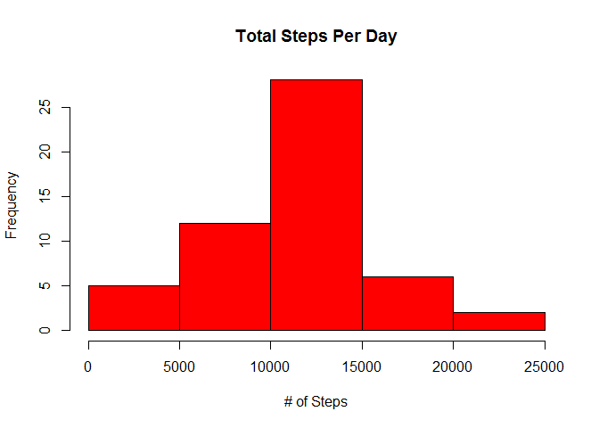
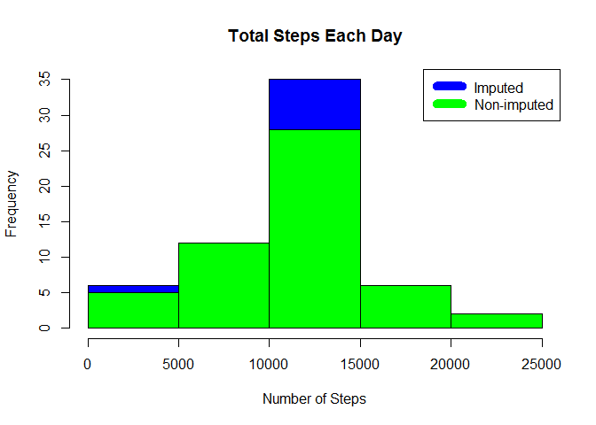

# Fitbit Data Analysis
Andrew Cox  
June, 2016  


## Loading the data

This is the code for loading the activity data.


```r
activity <- read.csv("C:/Users/drew/Desktop/activity.csv")
```

## Histogram 

This section is for the histogram, mean, and median calculations.

This is the histogram.

```r
steps_per_day <- aggregate(steps ~ date, activity, sum)
hist(steps_per_day$steps, main = paste("Total Steps Per Day"), col="red", xlab="# of Steps")
```

<!-- -->


```r
stepmean<-mean(steps_per_day$steps,na.rm = TRUE)
stepmedian<-median(steps_per_day$steps,na.rm = TRUE)
```

The mean steps per day is 1.0766189\times 10^{4} and the median steps per day is 10765.

## Average daily activity pattern


```r
steps_by_interval <- aggregate(steps ~ interval, activity, mean)

plot(steps_by_interval$interval,steps_by_interval$steps, type="l", xlab="Interval", ylab="Number of Steps",main="Average Number of Steps per Day by Interval")
```

<!-- -->


```r
high_interval <- steps_by_interval[which.max(steps_by_interval$steps),1]
```

The 5-minute interval, on average across all the days in the data set, containing the maximum number of steps is 835.

## Missing Values analysis

Missing data need to be imputed. For this assignment, the imputation method chosen was to simply replace the missing step value with an overall average.


```r
incomplete <- sum(!complete.cases(activity))
imputed_data <- transform(activity, steps = ifelse(is.na(activity$steps), steps_by_interval$steps[match(activity$interval, steps_by_interval$interval)], activity$steps))
```

Zeroes were imputed for 10-01-2012 because it was the first day and would have been over 9,000 steps higher than the following day, which had only 126 steps. NAs then were assumed to be zeros to fit the rising trend of the data.

```r
imputed_data[as.character(imputed_data$date) == "2012-10-01", 1] <- 0
```

Recount total steps by day and create Histogram.


```r
steps_per_day_i <- aggregate(steps ~ date, imputed_data, sum)
hist(steps_per_day_i$steps, main = paste("Total Steps Each Day"), col="blue", xlab="Number of Steps")

#Create Histogram to show difference. 
hist(steps_per_day$steps, main = paste("Total Steps Each Day"), col="green", xlab="Number of Steps", add=T)
legend("topright", c("Imputed", "Non-imputed"), col=c("blue", "green"), lwd=10)
```

<!-- -->

Calculate new mean and median for imputed data.


```r
rmean.i <- mean(steps_per_day_i$steps)
rmedian.i <- median(steps_per_day_i$steps)
```

Calculate difference between imputed and non-imputed data.


```r
mean_diff <- rmean.i - stepmean
med_diff <- rmedian.i - stepmedian
```

Calculate total difference.


```r
total_diff <- sum(steps_per_day_i$steps) - sum(steps_per_day$steps)
```

* The imputed data mean is 1.0589694\times 10^{4}.
* The imputed data median is 1.0766189\times 10^{4}.
* The difference between the non-imputed mean and imputed mean is -176.4948964.
* The difference between the non-imputed median and imputed median is 1.1886792.
* The difference between total number of steps between imputed and non-imputed data is 7.5363321\times 10^{4}. 

## Possible differences in activity patterns between weekdays and weekends

Based on the figures below, there is a spike in activity during the weekdays, there is overall more activity on the weekends. 


```r
weekdays <- c("Monday", "Tuesday", "Wednesday", "Thursday", 
              "Friday")
imputed_data$dow = as.factor(ifelse(is.element(weekdays(as.Date(imputed_data$date)),weekdays), "Weekday", "Weekend"))

steps_by_interval_i <- aggregate(steps ~ interval + dow, imputed_data, mean)

library(lattice)

xyplot(steps_by_interval_i$steps ~ steps_by_interval_i$interval|steps_by_interval_i$dow, main="Average Steps per Day by Interval",xlab="Interval", ylab="Steps",layout=c(1,2), type="l")
```

<!-- -->


